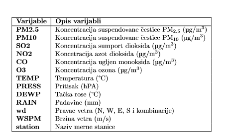
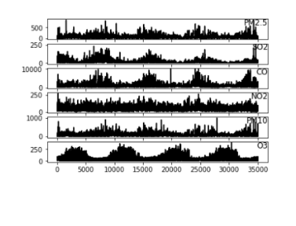
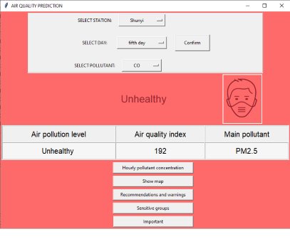

# ML-air-pollution-prediction

   

**Autor**: Kristina Matović

   

Zagađenje vazduha, kao negativan efekat urbanizacije i industrijalizacije, je bitan faktor rizika po zdravlje ljudske populacije širom sveta. Poslednja istraživanja organizacije za ekonomsku saradnju i razvoj (eng. *OECD*) predviđaju da će do 2050. godine na globalnom nivou zagađenje vazduha nadmašiti konsekvence nedostatka sanitarnih uslova i zagađene vode i postati najveći uzrok preranih smrti izazvanih faktorima životne sredine. Ocenjivanje kvaliteta vazduha u zonama i algomeracijama vrši se primenom kriterijuma za ocenjivanje sumpor dioksida, azot dioksida i oksida azota, suspendovanih čestica  i  (eng. *particulate matter*}), olova, benzena i ugljen monoksida u vazduhu.  su suspendovane čestice prečnika manjeg od  , a    su fine suspendovane čestice prečnika manjeg od . Cilj rada jeste upoznavanje sa problemom aerozagađenja i razvoj modela za predikciju kvaliteta vazduha naredni sat ili 5 dana po satima.

Rad je podeljen u 5 celina. U prvoj celini (*01.ipynb*) opisana je baza podataka i sprovedena osnovna analiza nad njom. Baza podatka sadrži rezultate merenja koncentracije primarnih i sekundarih polutanata sa 12 mernih stanica Centra za nadgledanje životne sredine u Pekingu za vremenski period od 1 marta 2013. do 28 februara 2018. po satima (*Tabela 1 i Slika 1*). Meterološki podaci za svaku od 12 mernih stanica preuzeti su sa najbliže meterološke stanice Kineskog meterološkog zavoda. U drugoj celini (*02.ipynb*) eliminisane su nedostajuće vrednosti koncentracija za svaki od polutanata prihvatanjem vrednosti koncentracije sa najbliže stanice ili metodom linearne interpolacije. U trecoj (*03.ipynb*), i ujedno najbitnijoj celini, paznja je posvećena modelima mašinskog ucenja za predviđanje koncentracije različitih polutanata za naredni sat i za pet dana po satima. Pored CatBoost algoritma kao glavnog izabranog modela za koji su prikazana predviđanja za svaki od polutanata, upotrebljeni su i XGBoost, AdaBoost, Random Forest i Gradient Boosting modeli, te su njihovi rezultati upoređeni na osnovu vrednosti korena srednje kvadratne greške ( *RMSE* ), koeficijenta determinacije ( *R2* ) i srednje apsolutne greške ( *MAE* ). U četvrtoj celini (*04.ipynb*) primenjeni su modeli neuronskih mreža sa LSTM slojem, sa i bez meteroloških podataka kao prediktora, za predviđanje koncentracije PM2.5 naredni sat, i rezultati su prikazani i upoređeni. U petoj celini (*05.ipynb*) dat je primer GUI-a za predikciju trenda kvaliteta vazduha i na njemu su prikazane prethodno predviđene vrednosti koncentracije polutanata dobijene CatBoost modelom. (*Slika 2*)

   
   
   

  

   
   
   

  

   
   
   

  

   
   
   

**Literatura**:
   
* G. Kaur, J. Gao, S. Chiao, S. Lu and G. Xie, "Air Quality Prediction: Big Data and Machine Learning Approaches," International Journal of Environmental Science and Development, vol. 9(1), pp. 8-16, 2018.

* https://archive.ics.uci.edu/ml/datasets/Beijing+Multi-Site+Air-Quality+Data/ 

*  M. Z. Joharestani, C. Cao, X. Ni, B. Bashir and S. Talebiesfandarani, "PM2.5 Prediction Based on Random Forest, XGBoost,and Deep Learning Using Multisource Remote," Atmosphere, vol. 10, p. 373, 2019.

* A. V. Dorogush, V. Ershov and A. Gulin, "CatBoost: gradient boosting with categorical features support," ArXiv, 2018. 

